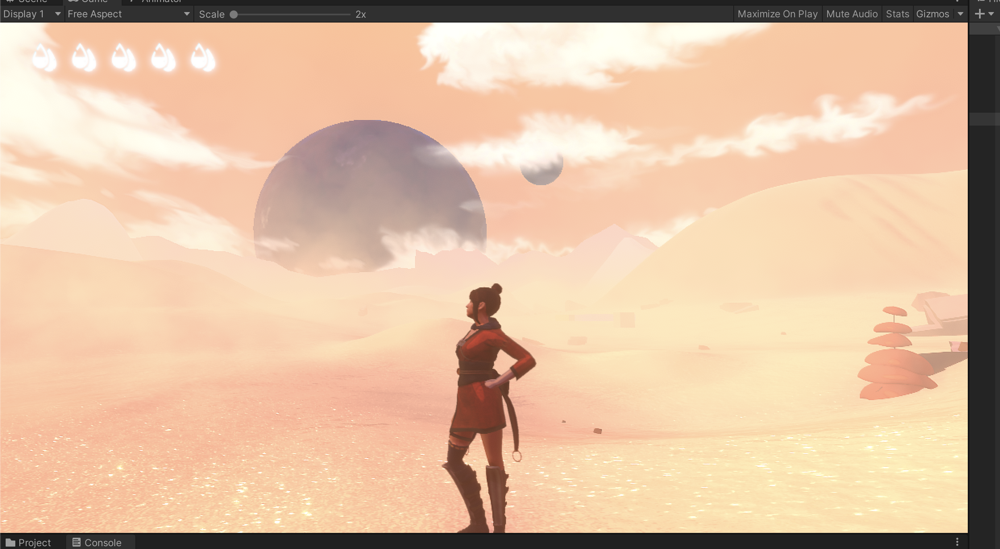
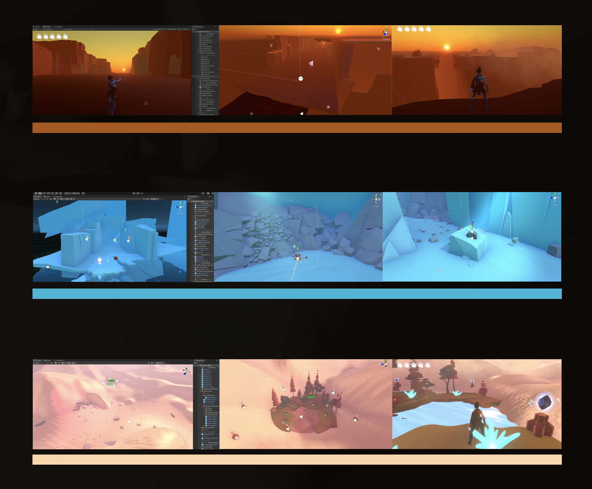

# CCI-CompEnv-Game-Retrieval

The term-final project for course Advanced Visualisation and Computational Environment

Individual Project

<video src="README.assets/Game_Start_00.mov"></video>

## Introduction

**Game** **Retrieval** is an indie adventure game in which you start from a lifeless and desolate valley, and experience retrieving the lost nature environment as well as water resources. During the journey of the game, you will also enjoy the aesthetics of the nature sceneries. 

The game is supposed to give you an immersive, impressive, and emotional experience, with the applications of custom shaders, fog, particles, and light renderings.

There are also interactions with the objects such as picking up staff, triggering door open, lightening grass and so on. 

### Story

There are three scenes in total which are in a cohesion, rhythmic tone. The transition from warm to cold, then back to a pinkish warm of atmosphere supports the moving story about “*lost, find, retrieve*”. 

You start from a desolate valley. A sense of lifelessness and  desperation would emerge especially when you found there is no way forward except jumping down to the Valley. Then you drop into an ice cave, in which you are supposed to see iced water, and learned to interact with objects. Finally, in the last scene of desert, in addition to the experience of the stunning visuals, you will find lost water-triggers to retrieve the nature.

### Goal

First and foremost, the goal is to bring players in to an immersive natural environment, to enable players to retrieving the excitement from adventuring in this virtual world.

Another goal is to remind people the serious environmental problem on the Earth. The transitions between the scenes and the interactions on calling water are all served as the visual, emotional, and kind rerminders.

Last but not least, my personal goal is to practice on writing shaders for stunning visual effects. In this game, I focused on the sand rendering shader, inspired by the game Journey. The glittering specular light dots, desert texture mappings, and various lighting models were achieved and ultimately left players a strong impression.

<video src="README.assets/Game_Sand_Running.mov"></video>

## Development and Design

- Character Retargeting
- UI & menu design, logo design
- Shader Explanation: Sand & Water Flow, (Toon Shading)
- More on how I built the scene: custom gradient skybox, lighting setup(Key, Fill, Rim), Fx Light, Particles, Fog
- Interactions: SendOnTrigger(), SimpleTranslator(), InteractOnTrigger(), SwitchMaterials(), SendGameCommand()

### Blog

